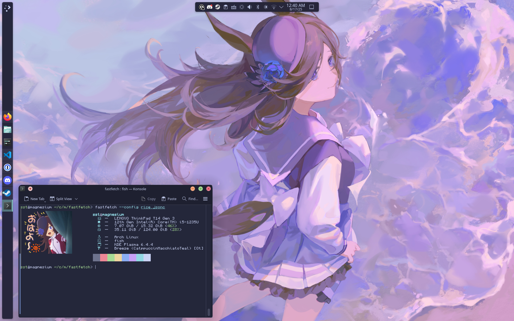

# `magnesium` dotfiles

i'm trying this arch linux thing again so here's the stuff i've been using so far. themed based off rice shower from umamusume

- 1password
  - modified .desktop file so quick access can be configured in DE settings (doesn't work out of box)
- `fastfetch`
- kde plasma
  - desktop & konsole themed using [catppuccin](https://catppuccin.com) macchiato
  - also [monocraft](https://github.com/IdreesInc/Monocraft) font used in konsole
  - [wallpaper](https://konachan.net/post/show/347326/animal_ears-anthropomorphism-hlymoriia-purple-rice) by haliya*
- `moonlight` (discord)
  - mostly for `nativeFixes` linux native updater
  - installed discord in user folder because client modding is incompatible with system installs basically
    - used [this script by @maddymeows](https://gist.github.com/maddymeows/6af1a5d5a870c13b7b159c4463edee70) to bootstrap

## todo

- find some way to reasonably manage this without making a hellish symlink script
  - surely someone made it that easy, right?
  - perfect excuse to learn iac ([pyinfra](https://docs.pyinfra.com/en/3.x/getting-started.html)?)
- ^ related: automate theme install by myself instead of using the catppuccin repo scripts
- should i submodule monocraft?
  - used the official nerdfont file, but found a lot of missing glyphs
  - maybe write a `PKGBUILD` for self-patching nerdfont glyphs

# license

MIT, with some file-by-file exceptions:

- `fastfetch/ohayo.png` comes from an official umamusume sticker pack, ARR cygames
- all submodules licensed as whatever their author used
